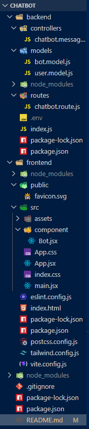

<div align="center">

# 🤖 ASHU THE GREAT CHATBOT

### An AI-Powered Holographic Chatbot with Limited Knowledge Base

[](https://nodejs.org/)
[](https://reactjs.org/)
[](https://www.mongodb.com/)
[](https://expressjs.com/)
[](https://tailwindcss.com/)
[](https://vitejs.dev/)
[](https://www.docker.com/)
[](https://vercel.com/)

<br/>


**Built with ❤️ by [Arshad Wasib Shaik](mailto:arshadshaik641@gmail.com)**

[Live Demo](#-live-demo) • [Features](#-features) • [Tech Stack](#-tech-stack) • [Installation](#-installation) • [API Documentation](#-api-documentation) • [Docker](#-docker-deployment) • [Contributing](#-contributing)

</div>

---

## 📋 Table of Contents

- [About The Project](#-about-the-project)
- [Live Demo](#-live-demo)
- [Features](#-features)
- [Tech Stack](#-tech-stack)
- [Project Architecture](#-project-architecture)
- [Folder Structure](#-folder-structure)
- [Prerequisites](#-prerequisites)
- [Installation & Setup](#-installation--setup)
- [Environment Variables](#-environment-variables)
- [Running the Application](#-running-the-application)
- [API Documentation](#-api-documentation)
- [API Testing with Postman](#-api-testing-with-postman)
- [Database Schema](#-database-schema)
- [Frontend Components](#-frontend-components)
- [UI/UX Design Details](#-uiux-design-details)
- [Docker Deployment](#-docker-deployment)
- [Vercel Deployment](#-vercel-deployment)
- [Screenshots](#-screenshots)
- [Troubleshooting](#-troubleshooting)
- [Future Enhancements](#-future-enhancements)
- [Contributing](#-contributing)
- [License](#-license)
- [Contact](#-contact)

---

## 🎯 About The Project

**ASHU THE GREAT CHATBOT** is a full-stack web application built using the **MERN Stack** (MongoDB, Express.js, React.js, Node.js). It is a rule-based chatbot with a **Holographic Glassmorphism UI/UX** design that answers questions related to:

- 💻 **Programming Languages** (Python, Java, JavaScript, C, C++, TypeScript, etc.)
- 📊 **Data Structures & Algorithms** (Array, LinkedList, Stack, Queue, Tree, Graph, Sorting, DP, etc.)
- 🌐 **Web Development** (React.js, Node.js, Express.js, MongoDB, REST API, MERN Stack)
- 👨‍💼 **IT Tech Roles** (Software Engineer, Frontend/Backend Developer, DevOps, Data Scientist, etc.)
- 🏛️ **Political Knowledge** (Indian politics, world organizations, government structure)
- 🏢 **Thinkly Labs** (Company info, services, technologies)
- 🎤 **Interview Preparation** (HR questions, technical concepts)
- 🔧 **Tools & Technologies** (Docker, Kubernetes, Git, AWS, CI/CD, etc.)
- 🧠 **OOP Concepts** (Encapsulation, Inheritance, Polymorphism, Abstraction)

### 🌟 What Makes This Project Unique?

| Feature | Description |
|---------|-------------|
| 🔮 Holographic UI | Glassmorphism design with blue & red holographic themes |
| ✨ Spark Animations | Moving spark/glow effects on borders |
| ⌨️ TypeWriter Effect | Welcome message types itself letter by letter |
| 🤖 Speech Synthesis | Robot speaks on first click using Web Speech API |
| 📧 Hanging Thread | Green glowing thread drops from robot avatar with email label |
| ⏱️ Timestamps | WhatsApp-style 12-hour time format on every message |
| 🧠 Thinking Animation | Bot shows "thinking" animation before responding |
| 💾 Session Persistence | Chat data persists on page refresh (sessionStorage) |
| 🖱️ Custom Cursor | Holographic cursor with spark trail effects |
| 📱 Responsive Design | Works on all screen sizes |

---

## 🔗 Live Demo

| Platform | URL |
|----------|-----|
| 🌐 Frontend (Vercel) | [https://ashu-chatbot.vercel.app](https://ashu-chatbot.vercel.app) |
| 🖥️ Backend API (Vercel) | [https://ashu-chatbot-api.vercel.app](https://ashu-chatbot-api.vercel.app) |

---

## ✨ Features

### Frontend Features
- ✅ Holographic Glassmorphism UI (Blue + Red theme)
- ✅ Spark border animations on header, footer, and robot avatar
- ✅ TypeWriter welcome message effect (one-time only)
- ✅ Custom holographic cursor with spark trail
- ✅ User messages with redish holographic background
- ✅ Bot messages with blueish holographic background
- ✅ "Ashu-Bot is thinking..." animation with bouncing dots
- ✅ WhatsApp-style timestamps (12-hour format with am/pm)
- ✅ Robot avatar with speech synthesis (first click only)
- ✅ Hanging green glowing thread with email label
- ✅ Session-based chat persistence (survives refresh)
- ✅ Custom scrollbar matching the theme
- ✅ Dynamic emoji favicon (🤖)
- ✅ Responsive design for all devices
- ✅ Copyright with dynamic year

### Backend Features
- ✅ RESTful API with Express.js
- ✅ MongoDB database for storing messages
- ✅ User message model (stores user questions)
- ✅ Bot message model (stores bot responses)
- ✅ 100+ predefined responses covering multiple domains
- ✅ Case-insensitive text matching
- ✅ Default response for unknown questions
- ✅ CORS enabled for cross-origin requests
- ✅ Error handling with proper HTTP status codes
- ✅ Environment variable configuration

---

## 🛠️ Tech Stack

### Frontend

| Technology | Version | Purpose |
|-----------|---------|---------|
| React.js | 19.x | UI Library (Component-based) |
| Vite | 6.x | Build tool & Dev server |
| Tailwind CSS | 3.x | Utility-first CSS framework |
| Axios | 1.x | HTTP client for API calls |
| React Icons | 5.x | Icon library |
| JavaScript (ES6+) | - | Programming language |
| CSS3 | - | Custom animations & Glassmorphism |
| Web Speech API | - | Text-to-Speech synthesis |
| Session Storage | - | Client-side data persistence |

### Backend

| Technology | Version | Purpose |
|-----------|---------|---------|
| Node.js | 20.x | JavaScript runtime |
| Express.js | 4.x | Web framework for REST API |
| MongoDB | 7.x | NoSQL database |
| Mongoose | 8.x | MongoDB ODM (Object Data Modeling) |
| CORS | 2.x | Cross-Origin Resource Sharing |
| dotenv | 16.x | Environment variable management |
| Nodemon | 3.x | Auto-restart dev server |

### DevOps & Deployment

| Technology | Purpose |
|-----------|---------|
| Git & GitHub | Version control & code hosting |
| Vercel | Frontend & Backend deployment |
| Docker | Containerization |
| Postman | API testing |
| npm | Package management |

---

## 🏗️ Project Architecture

┌─────────────────────────────────────────────────────────────┐
│                         CLIENT (Browser)                    │
│ ┌─────────────────────────────────────────────────────────┐ │
│ │ React.js + Vite + Tailwind CSS                          │ │
│ │                                                         │ │
│ │  ┌────────────┐   ┌────────────┐   ┌──────────────────┐ │ │
│ │  │  Bot.jsx   │   │  Bot.css   │   │   Speech API     │ │ │
│ │  │ Component  │   │  Styles    │   │ Text-to-Speech   │ │ │
│ │  └────────────┘   └────────────┘   └──────────────────┘ │ │
│ └─────────────────────────┬───────────────────────────────┘ │
│                           │ HTTP POST (Axios)               │
│                           ▼                                 │
│ ┌─────────────────────────────────────────────────────────┐ │
│ │                 Express.js REST API                     │ │
│ │                                                         │ │
│ │  ┌────────────┐   ┌────────────┐   ┌──────────────────┐ │ │
│ │  │   Routes   │   │ Controller │   │    Middleware    │ │ │
│ │  │  (chatbot) │   │  (Message) │   │  (cors, json)    │ │ │
│ │  └────────────┘   └────────────┘   └──────────────────┘ │ │
│ └─────────────────────────┬───────────────────────────────┘ │
│                           │ Mongoose ODM                   │
│                           ▼                                 │
│ ┌─────────────────────────────────────────────────────────┐ │
│ │                     MongoDB Atlas                       │ │
│ │                                                         │ │
│ │        ┌──────────────┐     ┌──────────────┐            │ │
│ │        │    Users     │     │     Bots     │            │ │
│ │        │  Collection  │     │  Collection  │            │ │
│ │        └──────────────┘     └──────────────┘            │ │
│ └─────────────────────────────────────────────────────────┘ │
└─────────────────────────────────────────────────────────────┘


### Request-Response Flow:
User types "What is React?" → Clicks SEND
React (Frontend) → axios.POST → http://localhost:4002/bot/v1/message
Express (Backend) → Receives { text: "What is React?" }
Controller → Saves user message to MongoDB (Users collection)
Controller → Matches text with botResponses object
Controller → Finds response for "what is react"
Controller → Saves bot response to MongoDB (Bots collection)
Controller → Returns JSON { userMessage, botMessage }
React (Frontend) → Receives response
React → Shows "thinking" animation for 1.5-3 seconds
React → Displays bot response with timestamp


---

## 📁 Folder Structure




---

## 📋 Prerequisites

Before running this project, make sure you have the following installed:

| Software | Minimum Version | Download Link |
|----------|----------------|---------------|
| Node.js | v20.x or higher | [nodejs.org](https://nodejs.org/) |
| npm | v10.x or higher | Comes with Node.js |
| MongoDB Atlas | Cloud account | [mongodb.com/atlas](https://www.mongodb.com/atlas) |
| Git | v2.x or higher | [git-scm.com](https://git-scm.com/) |
| VS Code | Latest | [code.visualstudio.com](https://code.visualstudio.com/) |
| Postman | Latest | [postman.com](https://www.postman.com/) |
| Docker (Optional) | v24.x or higher | [docker.com](https://www.docker.com/) |

### Verify Installation:

```bash
node -v          # Should show v20.x.x or higher
npm -v           # Should show v10.x.x or higher
git --version    # Should show git version 2.x.x
docker --version # (Optional) Should show Docker version 24.x.x


🚀 Installation & Setup
Step 1: Clone the Repository
git clone https://github.com/YOUR_USERNAME/ashu-chatbot.git
cd ashu-chatbot


Step 2: Setup Backend
# Navigate to backend folder
cd backend

# Install dependencies
npm install

# Create .env file
touch .env


Step 3: Setup Frontend
# Navigate to frontend folder (from root)
cd ../frontend

# Install dependencies
npm install


🔐 Environment Variables
Create a .env file inside the backend/ folder:

# Server Configuration
PORT=YOUR_PORT_NUMBER

# MongoDB Connection String
MONGO_URI=YOUR_MONGODB_CONNECTION_STRING


How to Get MongoDB URI:
Go to MongoDB Atlas
Create a free account
Create a new cluster (free tier)
Click "Connect" → "Connect your application"
Copy the connection string
Replace <password> with your actual password
Replace <dbname> with ashu-chatbot


