

# 🤖 ASHU THE GREAT CHATBOT

### An AI-Powered Holographic Chatbot with Limited Knowledge Base

 

**Built with ❤️ by [Arshad Wasib Shaik](mailto:arshadshaik641@gmail.com)**

[Live Demo](#-live-demo) • [Features](#-features) • [Tech Stack](#-tech-stack) • [Installation](#-installation) • [API Documentation](#-api-documentation) • [Docker](#-docker-deployment) • [Contributing](#-contributing)

---

## 📋 Table of Contents

- [About The Project](#-about-the-project)
- [Live Demo](#-live-demo)
- [Features](#-features)
- [Tech Stack](#-tech-stack)
- [Project Architecture](#-project-architecture)
- [Folder Structure](#-folder-structure)
- [Prerequisites](#-prerequisites)
- [Installation & Setup](#-installation--setup)
- [Environment Variables](#-environment-variables)
- [Running the Application](#-running-the-application)
- [API Documentation](#-api-documentation)
- [API Testing with Postman](#-api-testing-with-postman)
- [Database Schema](#-database-schema)
- [Frontend Components](#-frontend-components)
- [UI/UX Design Details](#-uiux-design-details)
- [Docker Deployment](#-docker-deployment)
- [Vercel Deployment](#-vercel-deployment)
- [Screenshots](#-screenshots)
- [Troubleshooting](#-troubleshooting)
- [Future Enhancements](#-future-enhancements)
- [Contributing](#-contributing)
- [License](#-license)
- [Contact](#-contact)

---

## 🎯 About The Project

**ASHU THE GREAT CHATBOT** is a full-stack web application built using the **MERN Stack** (MongoDB, Express.js, React.js, Node.js). It is a rule-based chatbot with a **Holographic Glassmorphism UI/UX** design that answers questions related to:

## 🧠 Knowledge Base Categories

> **ASHU-CHATBOT is powered by a curated knowledge base spanning 100+ topics across 12 categories:**

### 💻 Programming Languages

### 📊 Data Structures & Algorithms

### 🌐 Web Development (MERN Stack)

### 👨‍💼 IT Tech Roles

### 🏛️ Political Knowledge

### 🔧 Tools & Technologies

### 🧠 OOP Concepts

### 🎤 Interview Preparation

### 🏏 Sports

### 🏢 Thinkly Labs

# ✨ Unique Features & Innovations

> **Every feature below was conceptualized, designed, and developed by [Arshad Wasib Shaik](https://github.com/yourusername) — original ideas never seen before.**

### 🎬 1. Cinematic Matrix Decode Intro

<table>
<tr>
<td width="60%">

**A Hollywood-grade cinematic name reveal animation that plays when users first visit the chatbot.**

🔹 **Concept:** Inspired by movie title sequences — each letter of **"ARSHAD WASIB SHAIK"** starts as rapidly scrambling random characters and then **"locks in"** one by one with an electric blue flash, like a system decoding an identity

🔹 **Key Features:**
- 🖤 Dark cinematic background with HUD grid overlay
- 🔤 Matrix-style character scrambling (60fps)
- ⚡ Electric blue flash on each letter lock
- 🪞 Silver/Chrome metallic text with shimmer
- ✨ Shine sweep wave across completed name
- 📊 Live decode counter `[0/15] → [15/15]`
- 📡 Status: `DECODING...` → `IDENTITY CONFIRMED`
- 🖱️ Click-to-start (ensures sound plays on all devices)
- 🔊 Synced cinematic audio (`cinematic-reveal.mp3`)
- 📱 Cross-device: Mobile / Tablet / Laptop / Desktop
- ⚡ GPU-accelerated, zero janking

🔹 **Session-based:** Shows only once per browser session

</td>
<td width="40%" align="center">
</td>
</tr>
</table>

### 🖱️ 2. Custom Holographic Cursor

<table>
<tr>
<td width="60%">

**A mesmerizing holographic cursor system with particle trails — never seen before on any chatbot.**

🔹 **Key Features:**
- 🔵 **Holographic core dot** with rainbow color-shifting gradient
- 🔴 **Elastic following ring** that trails behind with spring physics
- ✨ **Particle trail** — glowing particles spawn as you move the cursor
- 💥 **Click burst** — 12 holographic diamond particles explode on click
- 🔗 **Connecting lines** — nearby particles form holographic connections
- 🟢 **Hover detection** — cursor expands on buttons/links/inputs
- 📱 **Touch ripple** — mobile devices get holographic touch ripple effect instead
- ⚡ **60fps** — requestAnimationFrame + GPU-accelerated transforms

🔹 **Intelligent Adaptation:**

| Device | Effect |
|:-------|:-------|
| 🖥️ Desktop | Full cursor + ring + trail + burst |
| 💻 Laptop | Full cursor + ring + trail + burst |
| 📱 Tablet | Reduced ring size + lighter trail |
| 📲 Mobile | Touch ripple effect (no cursor) |

</td>
<td width="40%" align="center">
</td>
</tr>
</table>

### ✅ 3. Message Status Tick System

<table>
<tr>
<td width="60%">

**A unique dual-color tick animation system that provides visual feedback for message delivery — inspired by WhatsApp but with a completely original design.**

🔹 **User Messages (Blue Theme):**
- 🔵 Single blue tick appears when message is sent
- 🔵🔵 Double blue tick appears when bot receives and starts processing
- Smooth slide-in animation with subtle glow

🔹 **Bot Messages (Red Theme):**
- 🔴 Single red tick appears when bot response is generated
- 🔴🔴 Double red tick confirms delivery to user's chat
- Smooth slide-in animation with subtle glow

🔹 **Unknown/Irrelevant Questions:**
- ⚫ Round dot with pulse animation (no tick)
- Indicates the question is outside knowledge base
- Continuous subtle pulse effect

🔹 **Animation Details:**
- Ticks slide in from right with spring easing
- Glow effect matches the color theme
- Second tick appears with 400ms delay after first
- Pulse dot uses infinite CSS animation

</td>
<td width="40%" align="center">
</td>
</tr>
</table>

### 🔊 4. Integrated Sound Effects System

<table>
<tr>
<td width="60%">

**Immersive audio feedback that makes the chatbot feel alive and interactive.**

🔹 **Sound Events:**

| Event | Sound | File |
|:------|:------|:-----|
| 🎬 Cinematic Intro | Epic reveal audio | `cinematic-reveal.mp3` |
| 📤 User sends message | Soft send whoosh | `send.mp3` |
| 📥 Bot responds | Gentle receive chime | `receive.mp3` |
| 🤖 First robot click | Bot voice introduction | Web Speech API |

🔹 **Technical Details:**
- Audio pre-warming on component mount for instant playback
- `playsInline` + `webkit-playsinline` for iOS Safari support
- Click-to-start pattern for mobile browser compliance
- Graceful fallback: App works perfectly without sound
- Volume-optimized: 0.5-0.7 range for comfortable listening

</td>
<td width="40%" align="center">
</td>
</tr>
</table>

### 📋 5. Interactive Notepad-List

<table>
<tr>
<td width="60%">

**A smart question browser that helps users discover what they can ask the chatbot — organized, searchable, and always accessible.**

🔹 **Key Features:**
- 📋 Notepad icon in footer with **vibration animation** (every 15s)
- 🟢 Glowing green pulse effect on the icon
- 🔲 Click to open — **floats to center** with spring animation
- 📑 **12 organized sections** matching knowledge base categories
- 🔀 **Sections shuffle** every 30 seconds for fresh discovery
- 👆 **Click any question** → auto-pastes in input field
- ❌ Click outside or ✕ button to close
- 📱 **Fully responsive** across all device sizes

🔹 **Sections Include:**

| # | Section | Questions |
|:-:|:--------|:---------:|
| 1 | 💬 General / Greetings | 15 |
| 2 | 💻 Programming Languages | 18 |
| 3 | 📊 Data Structures | 12 |
| 4 | ⚡ Algorithms | 18 |
| 5 | 🌐 Web Dev (MERN) | 14 |
| 6 | 🏛️ Political Knowledge | 14 |
| 7 | 👨‍💻 IT Tech Roles | 14 |
| 8 | 🔧 Tools & Technologies | 11 |
| 9 | 🧱 OOP Concepts | 6 |
| 10 | 🏢 Thinkly Labs | 8 |
| 11 | 🎤 Interview Prep | 3 |
| 12 | 🏏 Sports | 2 |
| | **Total** | **135+** |

</td>
<td width="40%" align="center">
</td>
</tr>
</table>

### 🤖 6. Bot Thinking Animation

<table>
<tr>
<td width="60%">

**A realistic "thinking" indicator that shows when the bot is processing a response.**

🔹 **Features:**
- Three animated dots (🔵 Blue → 🔵 Indigo → 🔴 Red)
- Bouncing animation with staggered delays
- Gradient text: **"🤖 Ashu-Bot is thinking...."**
- Rainbow gradient shift animation on text
- Random thinking delay: 1.5s - 3s (feels natural)
- Disappears when bot response arrives

</td>
<td width="40%" align="center">
</td>
</tr>
</table>

## 🏗️ Architecture & Design Decisions

> **Why each feature was built the way it was:**

<table>
<tr>
<th align="center">🎯 Feature</th>
<th align="center">⚙️ Technical Approach</th>
<th align="center">💡 Why This Way</th>
</tr>

<tr>
<td>🎬 Cinematic Intro</td>
<td>Pure CSS + JS animations, <code>useRef</code> for audio, <code>sessionStorage</code> for one-time show</td>
<td>No video dependency, instant load, works offline after first load</td>
</tr>

<tr>
<td>🖱️ Custom Cursor</td>
<td>Canvas API for particles, <code>requestAnimationFrame</code> for 60fps, CSS <code>will-change</code> for GPU</td>
<td>Canvas is faster than DOM for 60+ moving particles, GPU offloading prevents jank</td>
</tr>

<tr>
<td>✅ Tick System</td>
<td>CSS animations with <code>@keyframes</code>, conditional class toggling</td>
<td>Lightweight, no JS computation needed, pure CSS = zero render cost</td>
</tr>

<tr>
<td>🔊 Sound System</td>
<td><code>audio.load()</code> pre-warming, <code>playsInline</code> for iOS, <code>onTouchEnd</code> for mobile</td>
<td>Overcomes mobile browser audio restrictions, graceful degradation</td>
</tr>

<tr>
<td>📋 Notepad-List</td>
<td>Fisher-Yates shuffle, <code>setInterval</code> for auto-shuffle, portal-style modal</td>
<td>Helps discoverability, random order prevents familiarity blindness</td>
</tr>

<tr>
<td>💬 Chat Persistence</td>
<td><code>sessionStorage</code> for messages, typing state, overlay state</td>
<td>Survives refresh but clears on tab close — privacy-friendly</td>
</tr>

</table>

## 📱 Cross-Device Compatibility

> **Every feature is tested and optimized for all screen sizes and device types:**

| Feature | 📲 Mobile | 📱 Tablet | 💻 Laptop | 🖥️ Desktop |
|:--------|:---------:|:---------:|:---------:|:----------:|
| 🎬 Cinematic Intro | ✅ Adapted | ✅ Adapted | ✅ Full | ✅ Full |
| 🖱️ Custom Cursor | ✅ Touch Ripple | ✅ Reduced | ✅ Full | ✅ Full |
| ✅ Tick Animations | ✅ | ✅ | ✅ | ✅ |
| 🔊 Sound Effects | ✅ Click-to-play | ✅ Click-to-play | ✅ Auto | ✅ Auto |
| 📋 Notepad-List | ✅ Full Screen | ✅ Centered | ✅ Centered | ✅ Centered |
| 💬 Chat UI | ✅ Responsive | ✅ Responsive | ✅ Max-width | ✅ Max-width |
| 🤖 Thinking Dots | ✅ | ✅ | ✅ | ✅ |
| ⌨️ TypeWriter Effect | ✅ | ✅ | ✅ | ✅ |
| 🧵 Hanging Thread | ✅ | ✅ | ✅ | ✅ |

## 🎨 Design Philosophy

| Principle | Implementation |
|:----------|:---------------|
| 🖤 **Dark Cinematic Theme** | Deep navy/black backgrounds with holographic accents |
| 💎 **Glassmorphism** | Frosted glass effects with `backdrop-filter: blur()` |
| ⚡ **Spark Borders** | Rotating conic-gradient borders (Blue header, Red footer) |
| 🌈 **Holographic Colors** | Color-shifting gradients using `hue-rotate` animations |
| 🔵🔴 **Dual Color System** | Blue = System/Bot elements, Red = User/Interactive elements |
| 🟢 **Green Accents** | Success states, online indicators, notepad trigger |
| 🪞 **Chrome/Silver Text** | Metallic gradients for cinematic intro |
| 📐 **Consistent Spacing** | Uniform padding, margins, and border-radius throughout |
| ♿ **Accessibility** | `prefers-reduced-motion` support, semantic HTML |

## 👨‍💻 Author & Credits

### Designed & Developed with ❤️ by

## **Arshad Wasib Shaik**

> *"Every animation, every interaction, every pixel — crafted from scratch with original ideas, unique design thinking, and a passion for creating experiences that leave lasting impressions."*
>
> — **Arshad Wasib Shaik**

### 🌟 What Makes This Project Unique?

| Feature | Description |
|---------|-------------|
| 🔮 Holographic UI | Glassmorphism design with blue & red holographic themes |
| ✨ Spark Animations | Moving spark/glow effects on borders |
| ⌨️ TypeWriter Effect | Welcome message types itself letter by letter |
| 🤖 Speech Synthesis | Robot speaks on first click using Web Speech API |
| 📧 Hanging Thread | Green glowing thread drops from robot avatar with email label |
| ⏱️ Timestamps | WhatsApp-style 12-hour time format on every message |
| 🧠 Thinking Animation | Bot shows "thinking" animation before responding |
| 💾 Session Persistence | Chat data persists on page refresh (sessionStorage) |
| 🖱️ Custom Cursor | Holographic cursor with spark trail effects |
| 📱 Responsive Design | Works on all screen sizes |

## 🔗 Live Demo

| Platform | URL |
|----------|-----|
| 🌐 Frontend (Vercel) | [https://ashu-chatbot.vercel.app](https://ashu-chatbot.vercel.app) |
| 🖥️ Backend API (Vercel) | [https://ashu-chatbot-api.vercel.app](https://ashu-chatbot-api.vercel.app) |
## ✨ Features

### Frontend Features
- ✅ Holographic Glassmorphism UI (Blue + Red theme)
- ✅ Spark border animations on header, footer, and robot avatar
- ✅ TypeWriter welcome message effect (one-time only)
- ✅ User messages with redish holographic background
- ✅ Bot messages with blueish holographic background
- ✅ "Ashu-Bot is thinking..." animation with bouncing dots
- ✅ WhatsApp-style timestamps (12-hour format with am/pm)
- ✅ Robot avatar with speech synthesis (first click only)
- ✅ Hanging green glowing thread with email label
- ✅ Session-based chat persistence (survives refresh)
- ✅ Custom scrollbar matching the theme
- ✅ Dynamic emoji favicon (🤖)
- ✅ Responsive design for all devices
- ✅ Copyright with dynamic year

### Backend Features
- ✅ RESTful API with Express.js
- ✅ MongoDB database for storing messages
- ✅ User message model (stores user questions)
- ✅ Bot message model (stores bot responses)
- ✅ 100+ predefined responses covering multiple domains
- ✅ Case-insensitive text matching
- ✅ Default response for unknown questions
- ✅ CORS enabled for cross-origin requests
- ✅ Error handling with proper HTTP status codes
- ✅ Environment variable configuration

# 🛠️ Tech Stack

## 🎨 Frontend

| Logo | Technology | Version | Purpose |
|:----:|-----------|:-------:|---------|
|  | **React.js** | `19.x` | UI Library (Component-based) |
|  | **Vite** | `6.x` | Build tool & Dev server |
|  | **Tailwind CSS** | `3.x` | Utility-first CSS framework |
|  | **Axios** | `1.x` | HTTP client for API calls |
|  | **React Icons** | `5.x` | Icon library |
|  | **JavaScript (ES6+)** | `-` | Programming language |
|  | **CSS3** | `-` | Custom animations & Glassmorphism |
|  | **Web Speech API** | `-` | Text-to-Speech synthesis |
|  | **Session Storage** | `-` | Client-side data persistence |

## ⚙️ Backend

| Logo | Technology | Version | Purpose |
|:----:|-----------|:-------:|---------|
|  | **Node.js** | `20.x` | JavaScript runtime |
|  | **Express.js** | `4.x` | Web framework for REST API |
|  | **MongoDB** | `7.x` | NoSQL database |
|  | **Mongoose** | `8.x` | MongoDB ODM (Object Data Modeling) |
|  | **CORS** | `2.x` | Cross-Origin Resource Sharing |
|  | **dotenv** | `16.x` | Environment variable management |
|  | **Nodemon** | `3.x` | Auto-restart dev server |

## 🚀 DevOps & Deployment

| Logo | Technology | Purpose |
|:----:|-----------|---------|
|  | **Git** | Version control |
|  | **GitHub** | Code hosting & collaboration |
|  | **Vercel** | Frontend & Backend deployment |
|  | **Docker** | Containerization |
|  | **Postman** | API testing |
|  | **npm** | Package management |

## 📊 Quick Tech Overview

## 🏗️ Project Architecture

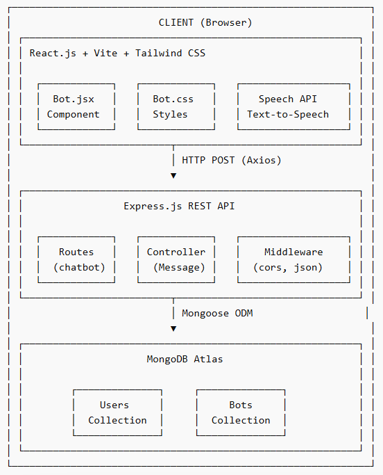

### Request-Response Flow:

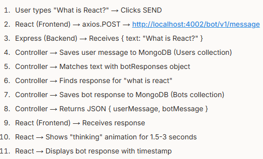

## 📁 Folder Structure

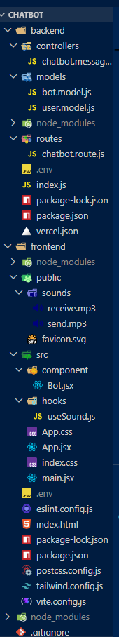

## 📋 Prerequisites

Before running this project, make sure you have the following installed:

| Software | Minimum Version | Download Link |
|----------|----------------|---------------|
| Node.js | v20.x or higher | [nodejs.org](https://nodejs.org/) |
| npm | v10.x or higher | Comes with Node.js |
| MongoDB Atlas | Cloud account | [mongodb.com/atlas](https://www.mongodb.com/atlas) |
| Git | v2.x or higher | [git-scm.com](https://git-scm.com/) |
| VS Code | Latest | [code.visualstudio.com](https://code.visualstudio.com/) |
| Postman | Latest | [postman.com](https://www.postman.com/) |
| Docker (Optional) | v24.x or higher | [docker.com](https://www.docker.com/) |

## Verify Installation:

- node -v          
### Should show v20.x.x or higher

- npm -v           
### Should show v10.x.x or higher

- git --version    
### Should show git version 2.x.x

- docker --version 
### (Optional) Should show Docker version 24.x.x

# 🚀 Installation & Setup

## Step 1: Clone the Repository

git clone https://github.com/Arshad-Shaik/ASHU-CHATBOT.git
cd ashu-chatbot

## Step 2: Setup Backend
### Navigate to backend folder
cd backend

## Install dependencies
npm install

## Create .env file
touch .env

## Step 3: Setup Frontend
### Navigate to frontend folder (from root)
cd ../frontend

## Install dependencies
npm install

## 🔐 Environment Variables
Create a .env file inside the backend/ folder:

## Server Configuration
PORT=YOUR_PORT_NUMBER

## MongoDB Connection String
MONGO_URI=YOUR_MONGODB_CONNECTION_STRING

## How to Get MongoDB URI:
- Go to MongoDB Atlas
- Create a free account
- Create a new cluster (free tier)
- Click "Connect" → "Connect your application"
- Copy the connection string
- Replace <password> with your actual password
- Replace <dbname> with ashu-chatbot

## ▶️ Running the Application
### Start Backend Server:
cd backend
npm run dev

### Expected output:
Backend Server application listening on port 4002
Connected to MongoDB

## Start Frontend Server:
cd frontend
npm run dev

## Expected output:
  VITE v6.x.x  ready in 500ms

  ➜  Local:   http://localhost:5173/
  ➜  Network: http://192.168.x.x:5173/

## Open in Browser:
http://localhost:5173

## 📡 API Documentation
### Base URL
http://localhost:4002/bot/v1

## Endpoints

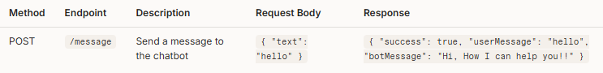

## Request Format:
POST /bot/v1/message HTTP/1.1
Host: localhost:4002
Content-Type: application/json

{
    "text": "what is react"
}

## Success Response (200 OK):
{
    "success": true,
    "userMessage": "what is react",
    "botMessage": "React.js is a JavaScript library for building user interfaces, developed by Facebook (Meta).\n• Component-based architecture...\n• Uses Virtual DOM for efficient re-rendering..."
}

## Error Responses:
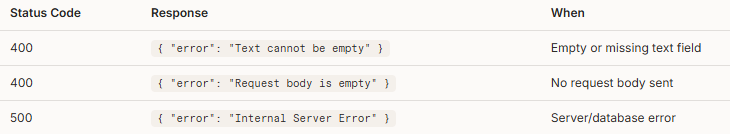

# 🧪 API Testing with Postman

## Step 1: Download & Install Postman
Download from: https://www.postman.com/downloads/ 

### or else - use Postman Extension via VS Code -> Just search in extensions tab from your left panel and search 'Postman' click on Install and use it, create new request and test your Backend API.

## Step 2: Create a New Request
Method:   POST
URL:      http://localhost:4002/bot/v1/message

## Step 3: Set Headers
Key:      Content-Type
Value:    application/json

## Step 4: Set Body
→ Select "Body" tab
→ Select "raw"
→ Select "JSON" from dropdown
→ Enter:

{
    "text": "hello"
}

## Step 5: Click "Send"

## Step 6: Verify Response
{
    "success": true,
    "userMessage": "hello",
    "botMessage": "Hi, How I can help you!!"
}

## Test Cases:
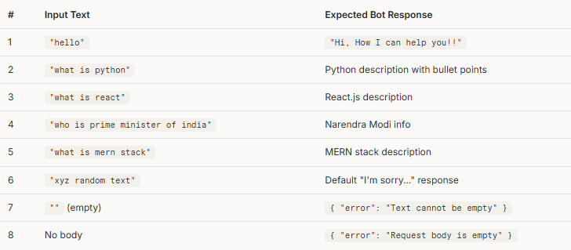

# 🗄️ Database Schema
## Users Collection

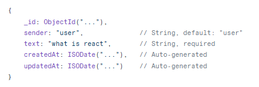

## Bots Collection

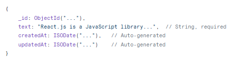

# 🎨 UI/UX Design Details
## Color Palette

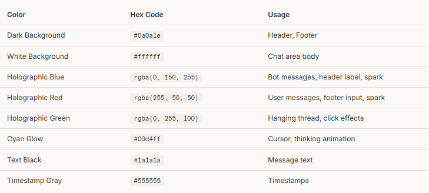

# Typography
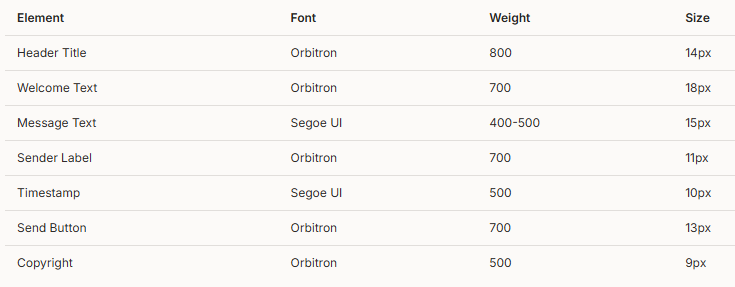

# Animations
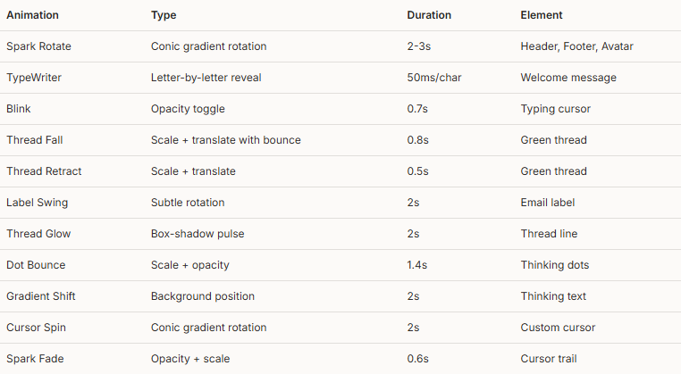

# 🐳 Docker Deployment
See [Docker Section](https://docker-curriculum.com/) below for full details.

# 🚀 Vercel Deployment
See [Vercel Section](https://vercel.com/docs/deployments) below for full details.

# 📸 Screenshots
## Welcome Screen

- 🤖 Holographic welcome with TypeWriter effect

## Chat Interface

- 🤖 User and Bot messages with timestamps

## Robot Avatar with Thread

- 🤖 Green glowing thread with email label

## Thinking Animation

- 🤖 Bouncing dots with gradient text

# 🔧 Troubleshooting

## ❗ req.body is undefined
👉 Add this before your routes:

app.use(express.json());

## ❗ White blank page
👉 Check browser console (F12)
👉 Verify App.jsx correctly imports Bot

## ❗ preamble error
👉 Move CSS from <style> tag
👉 Use a separate .css file

## ❗ CORS error
👉 Install and enable CORS in backend:

- npm install cors

- app.use(cors());

## ❗ MongoDB connection failed
👉 Check .env file → MONGO_URI
👉 Whitelist your IP in MongoDB Atlas

## ❗ RFC snippet not working
👉 Install VS Code extension:
ES7+ React/Redux Snippets

## ❗ PowerShell npm error
👉 Run this command:
- Set-ExecutionPolicy -Scope CurrentUser -ExecutionPolicy RemoteSigned

## ❗ Speech not working
👉 Speech API requires user interaction (click)
👉 It will NOT work on autoplay

# 🚀 Future Enhancements
 - 🤖 Integrate OpenAI/Gemini API for intelligent responses
 - 🔐 User authentication (Login/Signup)
 - 💬 Chat history with database persistence
 - 🌙 Dark/Light mode toggle
 - 📱 React Native mobile app
 - 🎙️ Voice input (Speech-to-Text)
 - 🌐 Multi-language support
 - 📊 Admin dashboard for analytics
 - 🔔 Push notifications
 - ⚡ WebSocket for real-time messaging

# 🤝 Contributing
### Contributions are welcome! Follow these steps:

- Fork the repository
- Create a feature branch (git checkout -b feature/amazing-feature)
- Commit changes (git commit -m 'Add amazing feature')
- Push to branch (git push origin feature/amazing-feature)
- Open a Pull Request

# 📜 License
## This project is licensed under the MIT [License](https://docs.github.com/en/repositories/managing-your-repositorys-settings-and-features/customizing-your-repository/licensing-a-repository) — see the LICENSE file for details.

MIT License

Copyright (c) 2026 Arshad Wasib Shaik

Permission is hereby granted, free of charge, to any person obtaining a copy
of this software and associated documentation files (the "ASHU-CHATBOT"), to deal
in the Software without restriction...

### ⭐ If this project impressed you, give it a star!

**Made in India 🇮🇳**

